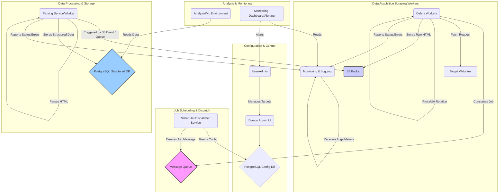
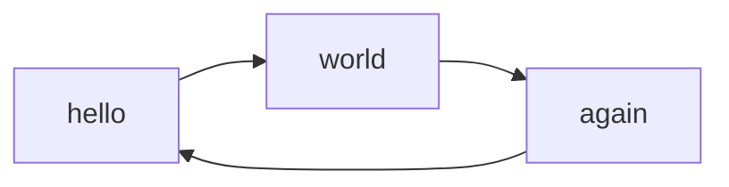

# System Overview

This section provides a high-level overview of the proposed architecture for the job scraping and processing system. The design emphasizes modularity, scalability, and decoupling through an event-driven approach.

| Component                 | Primary Function                                     |
| :------------------------ | :--------------------------------------------------- |
| Config DB (PostgreSQL)    | Stores scraping targets, settings, site metadata   |
| Django Admin              | UI for managing the Config DB                      |
| Dispatcher Service        | Reads config, creates & queues job messages        |
| Message Queue             | Decouples Dispatcher from Workers, holds jobs      |
| Celery Workers            | Execute scraping tasks (fetch, interact)           |
| S3 Bucket                 | Stores raw fetched HTML                            |
| Parsing Service/Worker    | Extracts structured data from raw HTML             |
| Structured DB (PostgreSQL)| Stores cleaned, structured job data                |
| Monitoring & Logging      | Collects logs & metrics for observability        |
| Analysis/ML Environment   | Consumes structured data for analysis              |

## Architecture Diagram

The following diagram illustrates the main components and data flow:

