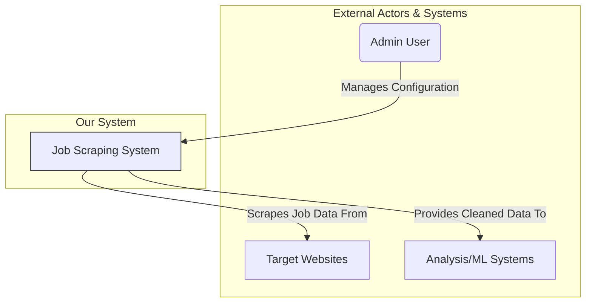
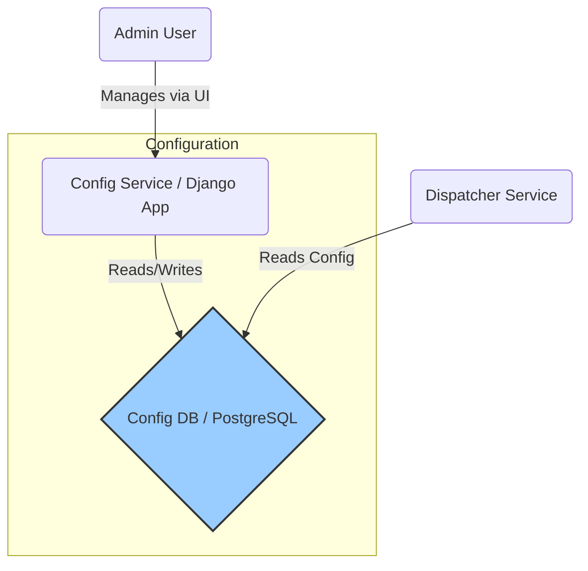
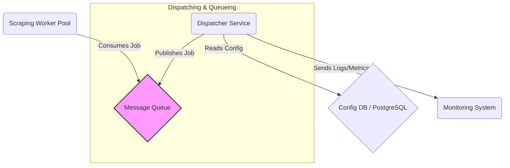
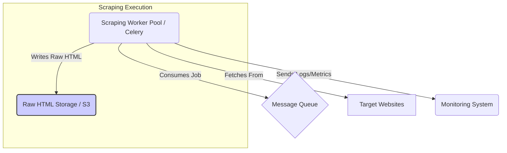
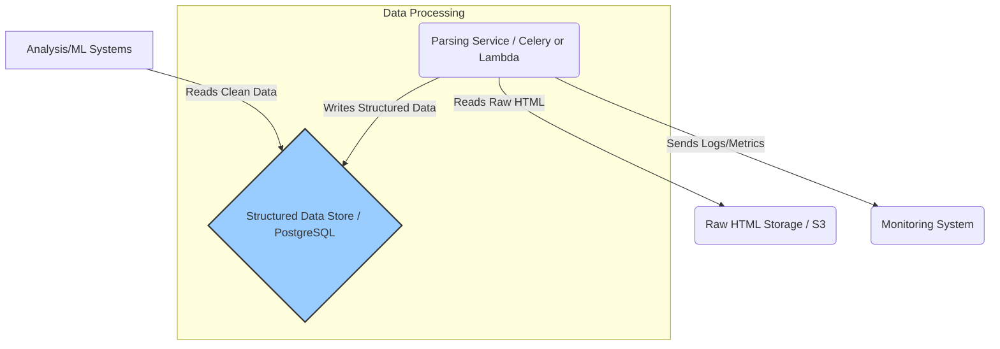
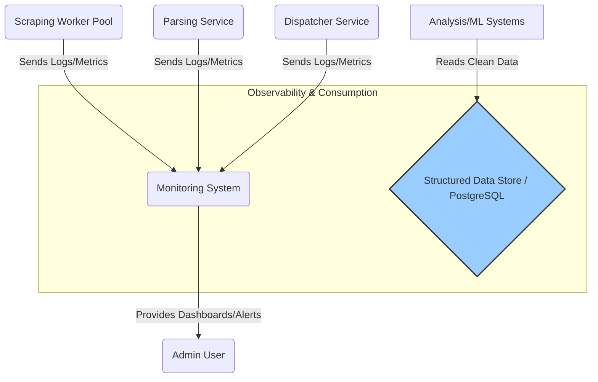

# System Overview

This section provides a high-level overview of the proposed architecture for the job scraping and processing system. The design emphasizes modularity, scalability, and decoupling through an event-driven approach.

| Component                 | Primary Function                                     |
| :------------------------ | :--------------------------------------------------- |
| Config DB (PostgreSQL)    | Stores scraping targets, settings, site metadata   |
| Django Admin              | UI for managing the Config DB                      |
| Dispatcher Service        | Reads config, creates & queues job messages        |
| Message Queue             | Decouples Dispatcher from Workers, holds jobs      |
| Celery Workers            | Execute scraping tasks (fetch, interact)           |
| S3 Bucket                 | Stores raw fetched HTML                            |
| Parsing Service/Worker    | Extracts structured data from raw HTML             |
| Structured DB (PostgreSQL)| Stores cleaned, structured job data                |
| Monitoring & Logging      | Collects logs & metrics for observability        |
| Analysis/ML Environment   | Consumes structured data for analysis              |

## Architecture Diagram

This section provides a high-level overview of the proposed architecture for the job scraping and processing system. To understand the system clearly, we'll look at it from two perspectives, inspired by the C4 model: System Context (Level 1) and focused Container views (Level 2).

## Level 1: System Context Diagram

This diagram shows the Job Scraping System as a single "black box" and illustrates how it interacts with its users and the external systems it depends on.

**Key Interactions (Context):**

1.  **Admin User:** Configures scraping targets, manages settings, monitors system health.
2.  **Job Scraping System:** The complete system.
3.  **Target Websites:** External sites providing job data.
4.  **Analysis/ML Systems:** Downstream consumers of the cleaned data.

---

## Level 2: Container Diagrams (Focused Views)

Instead of a single complex diagram, we break down the system's internal containers and interactions by focusing on one major subsystem at a time.

### 1. Configuration Subsystem Focus

This view shows how configuration is managed and accessed.

Focus: The Admin User interacts with the Config Service (Django App) to manage settings stored in the Config DB. The Dispatcher Service reads from the Config DB to know what jobs to schedule.

### 2. Job Dispatching Subsystem Focus

This view shows how jobs are created and queued.

Focus: The Dispatcher Service reads from the Config DB, creates job messages, and publishes them to the Message Queue. The Scraping Worker Pool consumes jobs from the queue. The dispatcher also sends operational data to the Monitoring System.

### 3. Scraping Execution Subsystem Focus

This view shows how scraping tasks are executed and raw data is stored.

Focus: The Scraping Worker Pool consumes jobs from the Message Queue, interacts with external Target Websites, stores the fetched raw HTML in Raw HTML Storage, and sends operational data to the Monitoring System.

### 4. Data Processing Subsystem Focus

This view shows how raw data is processed and stored structurally.

Focus: The Parsing Service reads raw HTML from Raw HTML Storage, processes it, and writes the cleaned, structured data into the Structured Data Store. Downstream Analysis/ML Systems read from this store. The service also reports to the Monitoring System.

### 5. Monitoring & Analysis Subsystem Focus

This view shows how monitoring data is collected and how final data is consumed.

Focus: Various system components (Workers, Parsing, Dispatcher, etc.) send logs and metrics to the central Monitoring System. The Admin User views dashboards and receives alerts from Monitoring. Analysis/ML Systems consume the final data from the Structured Data Store.