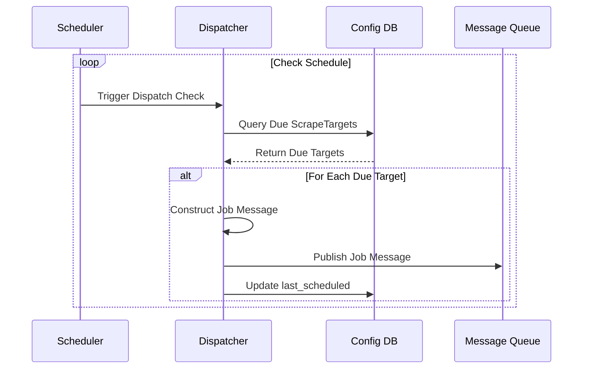

# Dispatcher Service

The Dispatcher acts as the brain coordinating the scraping activities based on the central configuration.



## Role & Purpose

*   Periodically queries the Configuration Database (Django/PostgreSQL) to identify active `ScrapeTarget` combinations that are due for execution based on their defined `frequency` and `last_scheduled` time.
*   Constructs specific job instructions for each due target.
*   Formats these instructions into messages suitable for the Message Queue.
*   Publishes these job messages to the Message Queue for consumption by the Scraper Workers.
*   Updates the `last_scheduled` timestamp in the Configuration Database for dispatched targets.

## Implementation Options

*   **Standalone Python Service:** A script running continuously or triggered periodically (e.g., via `cron` or a systemd timer). Uses a library like `SQLAlchemy` or Django's ORM (if run within Django context) to query the config DB and a library like `pika` (RabbitMQ), `boto3` (SQS), or `redis-py` to publish messages.
*   **Django Management Command:** A command integrated within the Django application, scheduled using `cron` or similar. Can directly use Django's ORM.
*   **Celery Beat Task:** Utilize Celery's periodic task scheduler (`Celery Beat`) to run the dispatch logic as a recurring task within the Celery ecosystem, especially if Celery is already heavily used. Can directly use Django's ORM if configured.
*   **Serverless Function (e.g., AWS Lambda, Google Cloud Function):** Triggered on a schedule (e.g., CloudWatch Events). Queries the database (requires network access/credentials) and publishes to the queue.

## Job Message Content

Each message published to the queue needs to contain sufficient information for a worker to execute the scrape. Example contents:

```json
{
  "target_id": 123, // ID from ScrapeTarget table
  "website_id": 5,
  "website_name": "ExampleJobs.com",
  "search_url": "https://www.examplejobs.com/search?q=Python+Developer&loc=Remote&posted=24h",
  "requires_playwright": false,
  "pagination_type": "next_link",
  // ... other necessary site-specific metadata ...
  "keywords_used": ["Python Developer"],
  "location_used": "Remote",
  "attempt_count": 0 // Initial attempt
}
```