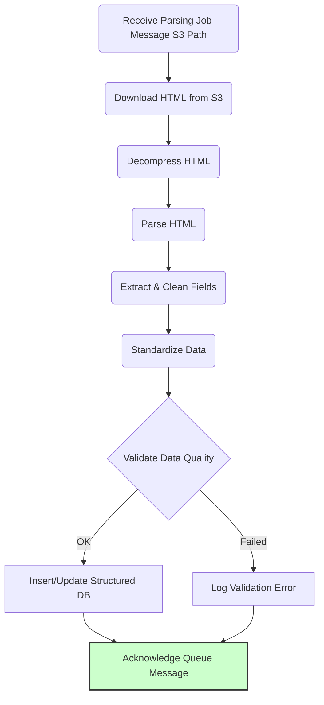

# Parsing & Structured Data Extraction

Once raw HTML content is successfully fetched and stored, it needs to be parsed to extract meaningful, structured information.

## Role & Purpose

*   Retrieve raw HTML content associated with a completed scraping job (typically from S3).
*   Parse the HTML structure.
*   Identify and extract specific data fields based on predefined rules or selectors (e.g., job title, company name, description, salary text).
*   Perform initial cleaning and standardization of extracted data (e.g., trim whitespace, format dates).
*   Load the structured, cleaned data into the target Structured Data Storage (PostgreSQL).

## Decoupled Approach

*   This parsing step is intentionally **decoupled** from the initial fetching step (scraper workers).
*   **Benefits:**
    *   Allows fetching and parsing to scale independently.
    *   Enables reprocessing of raw HTML from S3 if parsing logic changes, without re-scraping websites.
    *   Parsing might have different resource requirements (more CPU-bound for parsing, less I/O-bound compared to fetching).

## Implementation Options

### Option A: Dedicated Parsing Workers (Celery)

*   **Workflow:**
    1.  Scraper worker successfully fetches HTML and uploads to S3.
    2.  Scraper worker (or an S3 event trigger) publishes a "parsing job" message to a *separate* Message Queue, including the S3 path of the raw HTML.
    3.  A dedicated pool of Celery workers consumes these parsing messages.
    4.  The parsing worker downloads the HTML from S3, decompresses it, parses it, and inserts the structured data into PostgreSQL.
*   **Pros:** Clear separation of concerns, independent scaling of parsing workers.
*   **Cons:** Requires an additional queue and message flow.

### Option B: Serverless Functions (e.g., AWS Lambda)

*   **Workflow:**
    1.  Scraper worker uploads raw HTML to S3.
    2.  Configure an S3 event notification to trigger a Lambda function (or Google Cloud Function/Azure Function) whenever a new HTML file is created.
    3.  The serverless function receives the event (containing S3 path), downloads the HTML, parses it, and inserts data into PostgreSQL (requires appropriate permissions and network configuration).
*   **Pros:** Potentially simpler infrastructure management (no parsing workers to manage), scales automatically based on S3 events.
*   **Cons:** Limited execution time/memory (usually configurable but has limits), potential cold starts, managing database connections efficiently from serverless functions requires care.

### Option C: Integrated Parsing (Less Recommended for Decoupling)

*   **Workflow:** The *same* scraper worker that fetches the HTML immediately parses it before finishing the task.
*   **Pros:** Simpler flow, fewer components.
*   **Cons:** Tightly couples fetching and parsing; loses the ability to re-parse from S3 independently; workers become heavier; harder to scale fetching and parsing independently.

**Recommended Approach:** Option A (Dedicated Parsing Workers) or Option B (Serverless Functions) are generally preferred for better decoupling and scalability over Option C. The choice between A and B depends on operational preference and existing infrastructure.

## Parsing Libraries

*   **Python Libraries:** Use standard, efficient libraries like:
    *   `BeautifulSoup4`: Flexible and forgiving parser, easy to use.
    *   `lxml`: Very fast XML/HTML parser, often used with `BeautifulSoup` or directly via its `etree` interface.
    *   `parsel`: The selector library used by Scrapy, can be used standalone, supports CSS and XPath selectors well.

## Selector Management

*   Parsing logic often relies on CSS selectors or XPath expressions to locate data. These can be brittle if website structure changes.
*   Store selectors potentially in the Configuration Database alongside website metadata, allowing easier updates without code deployments for simple selector changes.
*   Implement robust error handling in parsing logic to detect when selectors fail.