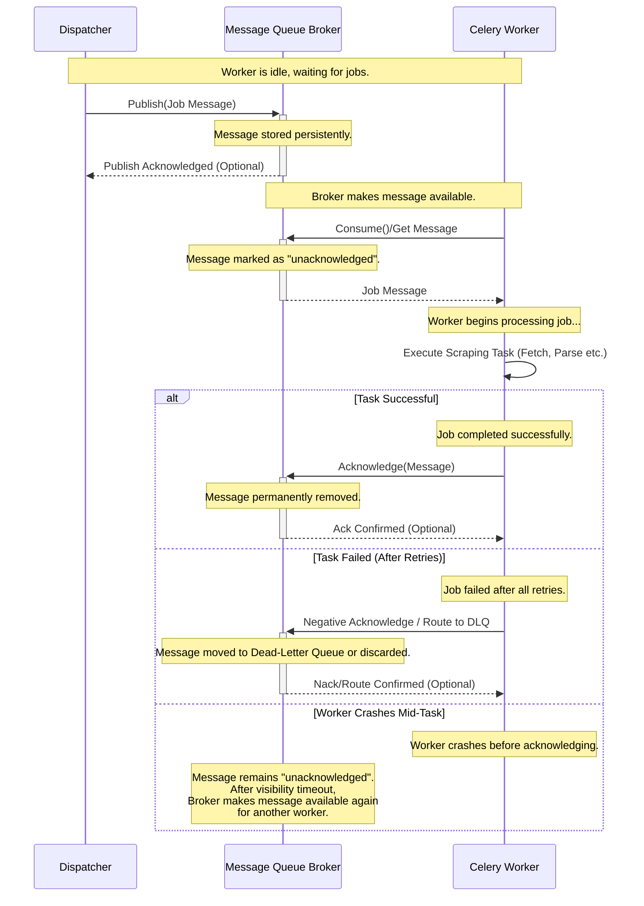

# Task Queue

The Message Queue is the central communication channel decoupling the Dispatcher from the pool of Scraper Workers.

## Role & Purpose

*   Acts as a buffer holding job messages sent by the Dispatcher.
*   Distributes job messages to available Scraper Workers.
*   Enhances system resilience: If workers are down, messages wait in the queue. If the dispatcher is down, workers continue processing existing messages.
*   Enables independent scaling of Dispatcher and Workers.

## Technology Choices

*   **RabbitMQ:** Feature-rich, mature, protocol-based (AMQP) message broker. Offers routing flexibility, acknowledgements, persistence, and DLQ support. Requires separate deployment and management.
*   **Redis:** Often used as a simpler message broker for Celery. Fast in-memory store, but persistence and reliability features might be less robust than RabbitMQ depending on configuration. Can serve multiple purposes (caching, broker).
*   **AWS SQS (Simple Queue Service):** Fully managed cloud service. Highly scalable and durable. Offers standard and FIFO queues, DLQ support. Reduces operational overhead. Pay-per-use pricing.
*   **Google Cloud Pub/Sub:** Fully managed cloud service. Global scale, push/pull delivery, filtering. Reduces operational overhead.

**Selection Criteria:** Choice depends on factors like existing infrastructure, operational preferences (managed vs. self-hosted), required features (e.g., message ordering guarantees - usually not needed for scraping jobs), and scalability needs. Managed services (SQS, Pub/Sub) are often preferred for cloud-native deployments to reduce operational burden.

## Key Features Used

*   **Message Persistence:** Ensure messages are not lost if the broker restarts.
*   **Worker Acknowledgements:** Workers should acknowledge messages only *after* successfully completing the task (or deciding it's a terminal failure) to prevent message loss if a worker crashes mid-task.
*   **Dead-Letter Queue (DLQ) Support:** Automatically route messages that fail repeatedly to a separate queue for investigation.
*   **Scalability:** The queue system must handle the peak rate of job dispatch and consumption.

## Interaction Flow

1.  Dispatcher publishes a job message to a specific queue/topic.
2.  The Message Broker makes the message available.
3.  An available Celery Worker retrieves (consumes) the message.
4.  The Worker processes the job.
5.  Upon completion/failure, the Worker sends an acknowledgement (`ack`) to the Broker, removing the message from the queue (or routing to DLQ upon repeated failure).