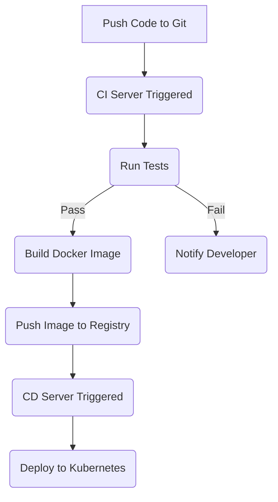

# Deployment & Orchestration

Managing the deployment, scaling, and lifecycle of the various system components requires robust orchestration, especially at scale.

## Containerization

*   **Technology:** Docker
*   **Purpose:** Package each service component (Django app, Dispatcher, Celery workers with scraping dependencies, Parsing service) along with its dependencies into standardized, portable container images.
*   **Benefits:** Ensures consistency across development, testing, and production environments. Simplifies dependency management. Enables easier scaling and deployment.

## Container Orchestration

*   **Technology:** Kubernetes (K8s) - potentially using managed services like AWS EKS, Google GKE, or Azure AKS.
*   **Purpose:** Automate the deployment, scaling, management, and networking of containerized applications.
*   **Key Benefits for this System:**
    *   **Automated Scaling:** Use Horizontal Pod Autoscaler (HPA) to automatically scale the number of Celery worker pods based on metrics like message queue depth (requires custom metrics adapter like KEDA) or CPU/memory usage.
    *   **Deployment Strategies:** Perform rolling updates or canary deployments to release new code versions with minimal downtime.
    *   **Self-Healing:** Automatically restarts containers/pods that fail health checks.
    *   **Resource Management:** Define CPU and memory requests/limits for containers to ensure efficient resource allocation and prevent noisy neighbor problems.
    *   **Service Discovery & Load Balancing:** Manages internal communication between services (e.g., workers connecting to databases or queues).
    *   **Configuration & Secrets Management:** Securely manage database credentials, API keys, and other sensitive configuration.

## Infrastructure as Code (IaC)

*   **Technologies:** Terraform, Pulumi, AWS CloudFormation, Azure Resource Manager, Google Cloud Deployment Manager.
*   **Purpose:** Define and manage all cloud infrastructure resources (Kubernetes cluster, managed databases, message queues, S3 buckets, IAM roles, monitoring setup) using declarative configuration files stored in version control.
*   **Benefits:**
    *   **Reproducibility:** Easily create identical environments (dev, staging, prod).
    *   **Automation:** Automate infrastructure provisioning and updates.
    *   **Version Control:** Track changes to infrastructure over time.
    *   **Disaster Recovery:** Faster recreation of infrastructure if needed.

## CI/CD Pipelines

*   **Technologies:** GitHub Actions, GitLab CI, Jenkins, CircleCI.
*   **Purpose:** Automate the process of building container images, running tests (unit, integration), and deploying updated application code and infrastructure changes.
*   **Typical Workflow:**
    1.  Code pushed to Git repository.
    2.  CI pipeline triggers: runs tests, performs static analysis.
    3.  If tests pass, build new Docker images.
    4.  Push images to a container registry (e.g., Docker Hub, ECR, GCR, ACR).
    5.  CD pipeline triggers: applies Kubernetes deployment updates, potentially runs IaC tool for infrastructure changes.

## Role of Managed Cloud Services

*   **Purpose:** Leverage cloud provider services to reduce operational overhead for common infrastructure components.
*   **Examples:**
    *   **Message Queues:** AWS SQS, Google Pub/Sub, Azure Service Bus (handle scaling, availability, durability).
    *   **Databases:** AWS RDS/Aurora, Google Cloud SQL, Azure SQL DB (handle patching, backups, scaling, high availability).
    *   **Object Storage:** AWS S3, Google Cloud Storage, Azure Blob Storage (highly scalable and durable storage).
    *   **Container Registry:** AWS ECR, Google GCR, Azure ACR (store Docker images).
    *   **Kubernetes:** AWS EKS, Google GKE, Azure AKS (manage the K8s control plane).

By combining these orchestration tools and practices, the system can be deployed, scaled, and managed effectively and reliably.