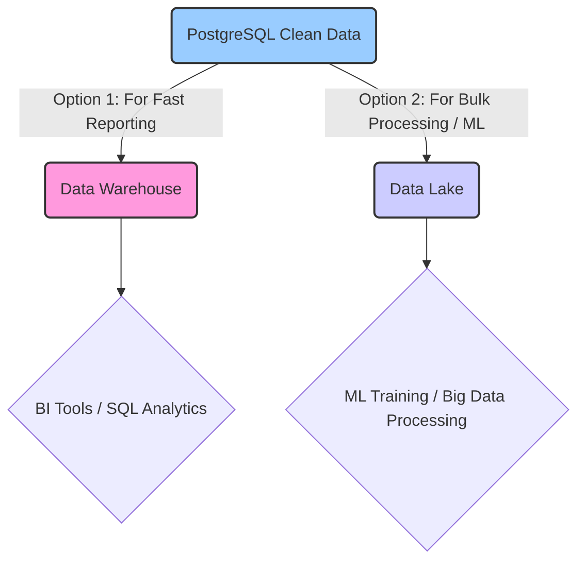

# Where to Store Data for Analysis

The primary PostgreSQL database holds the cleaned, structured job data. While excellent for many tasks, different storage systems might be better suited for very large-scale analysis or specific types of processing.

## PostgreSQL: The Primary Clean Data Store

*   **Role:** Main repository for reliable, up-to-date, structured job information.
*   **Good For:**
    *   Serving data to applications or dashboards.
    *   Running standard SQL queries for reports.
    *   Providing data for smaller-scale analysis or ML model building (by querying and loading data into tools like Python/Pandas).
*   **Potential Limits:** May become slower for extremely complex analytical queries over huge amounts of historical data, or if heavy analysis interferes with ongoing data collection.

## Considering Other Options for Scale

As data volume grows or analysis needs become more intensive, these specialized systems might be added *alongside* PostgreSQL:

## Alternative/Complementary Storage Solutions

### 1. Data Warehouse (e.g., Snowflake, BigQuery, Redshift)

*   **Purpose:** Optimized for Online Analytical Processing (OLAP) - running complex SQL queries over large volumes of data.
*   **Architecture:** Typically uses columnar storage, massively parallel processing (MPP).
*   **Use Case:**
    *   Business Intelligence (BI) and reporting using tools like Tableau, Power BI, Looker.
    *   Running complex SQL aggregations, window functions over historical job data.
    *   Providing a performant, dedicated resource for analytical queries, separate from the operational database.
*   **Integration:** Requires an **ETL (Extract, Transform, Load)** or **ELT (Extract, Load, Transform)** process to periodically copy and potentially reshape data from the operational PostgreSQL database into the data warehouse. Tools like Airflow, dbt, Fivetran, or custom scripts can manage this.

### 2. Data Lake (e.g., S3, GCS, ADLS + Query Engines)

*   **Purpose:** Store vast amounts of structured, semi-structured, and unstructured data cost-effectively in open file formats. Decouple storage from compute.
*   **Architecture:** Stores data as files (e.g., **Apache Parquet**, ORC) on object storage. Uses query engines (e.g., **Apache Spark**, Presto/Trino, AWS Athena) or processing frameworks to interact with the data.
*   **Use Case:**
    *   Storing large datasets for **ML model training** (Spark MLlib, PyTorch/TensorFlow often read efficiently from Parquet).
    *   Exploratory data analysis by data scientists using tools like Spark or Dask.
    *   Archiving historical processed data cost-effectively.
    *   Handling data volumes potentially exceeding comfortable/cost-effective limits for a data warehouse.
*   **Integration:** Requires a process (often using Spark, Dask, or Airflow) to extract data from PostgreSQL and write it to the data lake in an optimized format (like partitioned Parquet files).

## Recommendation Path

1.  **Start with PostgreSQL:** Use the primary PostgreSQL database (containing cleaned, structured data) as the initial source for both analysis and ML data extraction. Optimize it with appropriate indexing.
2.  **Monitor Performance:** Observe query performance and database load as data volume grows and analytical/ML workloads increase.
3.  **Introduce Data Warehouse (If Needed for BI/Analytics):** If complex SQL-based analytics and BI reporting become slow or interfere with operational performance, implement an ELT process to move data into a dedicated Data Warehouse (Snowflake, BigQuery, Redshift).
4.  **Introduce Data Lake (If Needed for Large-Scale ML/Storage):** If ML training datasets become very large, or if cost-effective storage for processed historical data is required, implement a pipeline to export data (e.g., daily/hourly snapshots) from PostgreSQL to a Data Lake (S3/GCS/ADLS as Parquet files). ML training pipelines can then read directly from the Data Lake.

PostgreSQL serves as an excellent, reliable source, but complementing it with a Data Warehouse or Data Lake provides optimized solutions for specific large-scale analytical and ML workloads.