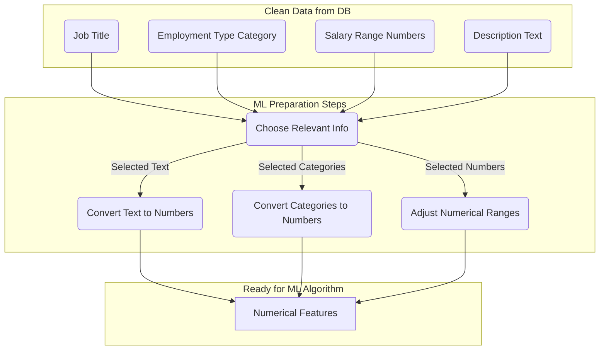

# Preparing Data for Computer Analysis (ML)

If the goal is to use the collected job data for tasks like predicting salaries, classifying job types automatically, or building recommendation systems (often called Machine Learning or ML), the data needs further transformation into a purely numerical format that computer algorithms can understand.

## Where This Happens

*   This preparation usually happens **separately** from the main database cleaning, often right before the analysis or prediction task begins.
*   It's typically done using programming tools (like Python with specific data analysis libraries) after loading the required clean data from PostgreSQL.

## General Goal: Data to Numbers

Machine learning algorithms work primarily with numbers. Therefore, the main goal is to convert all relevant pieces of information, especially text and categories, into a numerical representation.

## Common ML Preprocessing Steps

### 1. Feature Selection
Goal: Select only the pieces of data (features) that are actually useful for the specific prediction or analysis task.

Action: Decide which columns from the cleaned data table to use. For example, to predict salary, you might use job title, location, company size, and required skills, but maybe not the raw job ID.

### 2. Text Processing (for `description_text`, `job_title_raw`)

Goal: Represent words and sentences numerically so algorithms can find patterns.

Action: This involves techniques that might:

Count how often important words appear.

Assign scores to words based on their relevance.

Create numerical codes (vectors or embeddings) that capture the meaning or context of words or entire descriptions.

This is often applied to fields like job_title and description_text.
### 3. Categorical Feature Encoding

Goal: Represent non-numerical labels (like 'Full-time', 'Part-time', or specific city names if used as categories) numerically.

Action: Assign numerical codes to each category. This could be:

Simple unique numbers (e.g., Full-time=1, Part-time=2).

Creating separate "flag" columns (0 or 1) for each possible category.

### 4. Numerical Feature Scaling

Goal: Ensure that numerical fields with very different ranges (e.g., salary in thousands vs. years of experience from 1-10) don't unfairly influence certain algorithms.

Action: Rescale numbers to a common range (like 0 to 1, or centered around zero). This helps many algorithms learn more effectively.

### 5. Splitting Data
Goal: Check if the analysis or prediction model works on data it hasn't seen before.

Action: Before using the data, it's usually split into a 'training' set (to build the model) and a 'testing' set (to evaluate how well it performs).

These steps transform the clean, structured data into a numerical format suitable for ingestion by machine learning algorithms. The specific steps and methods chosen depend heavily on the ML task and the selected algorithm.