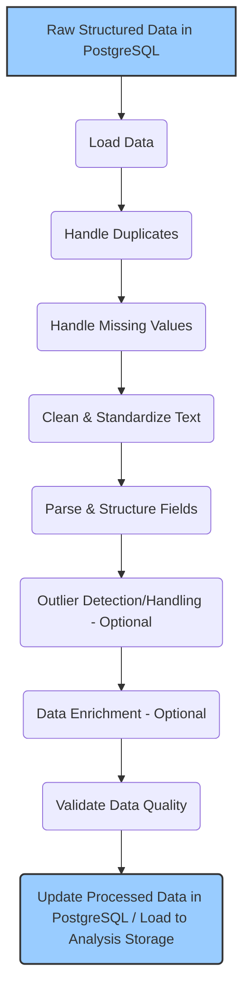

# Data Preprocessing Workflow

Once raw data is extracted and stored in the structured database (PostgreSQL), a dedicated preprocessing workflow is required to clean, standardize, and enrich the data, making it suitable for analysis or machine learning applications. This process typically runs after the initial parsing and insertion.

## Workflow Overview

The following diagram illustrates the key steps in the preprocessing pipeline:

## Detailed Steps
### 1. Load Data
Action: Select records from the PostgreSQL JobPostings table that require processing (e.g., newly inserted records or records marked for reprocessing).

Environment: This process typically runs in a dedicated environment (e.g., a separate Python service/script, potentially orchestrated via Celery, Airflow, or run periodically) using libraries like pandas or SQLAlchemy to interact with the database.

### 2. Handle Duplicates
Action: Identify and manage duplicate job postings. Duplicates might arise from scraping the same job from multiple sources or re-scraping slightly varied versions.

Methods:

Identify duplicates based on combinations of fields like source_url, job_id_on_source, company_name, job_title_raw, and potentially fuzzy matching on descriptions or key fields.

Choose a strategy: merge information from duplicates, keep the most complete/recent record, or flag duplicates.

Use SQL window functions or pandas duplicated() / drop_duplicates().

### 3. Handle Missing Values
Action: Address NULL or empty values in critical fields.

Methods (per field):

Deletion: Remove records if essential fields (like job_title or description) are missing (use with caution).

Imputation (Numerical): Fill missing numerical fields (e.g., derived salary components) with mean, median, or model-predicted values (less common for core scraped data).

Imputation (Categorical): Fill missing categorical fields (e.g., employment_type) with mode ('Unknown' or most frequent value).

Flagging: Add a boolean flag column indicating that a value was originally missing.

Default Values: Use sensible defaults (e.g., empty string for optional text fields).

### 4. Clean & Standardize Text
Action: Clean raw text fields like job_title_raw, company_name, location_raw, description_text.

Methods:

Remove extraneous HTML tags (if description_text isn't already plain text).

Trim leading/trailing whitespace.

Normalize whitespace (replace multiple spaces/newlines with single ones).

Standardize case (e.g., lowercase for easier matching, though preserve case for display if needed).

Handle special characters or encoding issues.

### 5. Parse & Structure Fields
Action: Extract structured information from semi-structured text fields (often populating JSONB columns or dedicated columns).

Methods:

Location: Parse location_raw into city, state, country, remote status using rule-based approaches (regex) or geolocation libraries/APIs (if budget allows). Store in location_structured (JSONB).

Salary: Parse salary_raw using regex to extract minimum/maximum values, currency symbols/codes, and pay periods (hourly, annual). Store in salary_structured (JSONB). Handle variations and ambiguity.

Date: Standardize publish_date into a consistent format (e.g., ISO 8601 TimestampTZ).

### 6. Outlier Detection/Handling (Optional)
Action: Identify and handle potentially erroneous extreme values, primarily in numerical fields derived later (e.g., extracted years of experience, parsed salary numbers).

Methods: Statistical rules (IQR, Z-score), visualization. Treatment might involve capping values, transforming data, or flagging outliers.

### 7. Data Enrichment (Optional)
Action: Add valuable information not directly present in the job posting.

Methods:

Company Data: Match company_name against external databases (e.g., Clearbit, Crunchbase APIs - requires budget) to add industry, company size, funding information.

Skill Extraction: Apply NLP techniques (keyword matching, NER) to description_text to populate the extracted_skills field.

Role/Seniority Classification: Apply rule-based logic or ML models to job_title_raw and description_text to populate categorized_role and seniority_level.

### 8. Validate Data Quality
Action: Perform final checks to ensure data meets expected quality standards.

Methods: Check for unexpected nulls, ensure standardized formats, validate ranges, potentially use schema validation tools (e.g., Pydantic for data loaded into Python objects). Log or flag records failing validation.

### 9. Update/Load Processed Data
Action: Save the cleaned, standardized, and enriched data.

Methods:

UPDATE the existing records in the primary PostgreSQL JobPostings table.

Alternatively, load the processed data into a separate table optimized for analysis or into a Data Warehouse/Lake.

This workflow ensures that the raw scraped data is transformed into a reliable, consistent, and enriched dataset ready for downstream use.