# Data Preprocessing Workflow

Once raw data is extracted and stored in the structured database (PostgreSQL), a dedicated preprocessing workflow is required to clean, standardize, and enrich the data, making it suitable for analysis or machine learning applications. This process typically runs after the initial parsing and insertion.

## Workflow Overview

The following diagram illustrates the key steps in the preprocessing pipeline:

```mermaid
graph LR
    A[Structured Data in PostgreSQL] --> B(Select Data for Processing);
    B --> C(Check for & Handle Duplicates);
    C --> D(Fill Obvious Missing Information);
    D --> E(Clean & Format Text Fields);
    E --> F(Structure Specific Fields - Location/Salary);
    F --> G(Review for Unusual Values - Optional);
    G --> H(Add Extra Info - Optional Enrichment);
    H --> I(Final Quality Check);
    I --> J(Save Cleaned Data);

    style A fill:#9cf,stroke:#333,stroke-width:2px
    style J fill:#9cf,stroke:#333,stroke-width:2px
```

## Detailed Steps
### 1. Load Data
Goal: Choose which records need cleaning (e.g., newly added jobs).

Action: Query the database for relevant records.

### 2. Handle Duplicates
Goal: Avoid having the exact same job listed multiple times unnecessarily.

Action: Find records that seem identical (based on URL, job ID, company/title). Decide whether to merge them, keep the best one, or just note that they are duplicates.

### 3. Handle Missing Values
Goal: Deal with empty fields where possible.

Action: For some fields, it might make sense to fill missing values (e.g., mark a missing employment_type as 'Unknown'). For others (like salary), leaving them empty might be better than guessing. Sometimes, records with too much missing critical info might be flagged or removed.

### 4. Clean & Standardize Text
Goal: Make text consistent and easy to read/process.

Action: Remove extra spaces or leftover HTML code. Ensure consistent capitalization (e.g., make everything lowercase for easier searching, or proper case for display). Fix any text encoding problems.

### 5. Parse & Structure Fields
Goal: Extract detailed information hidden within text fields.

Action:

Location: Try to identify city, country, and remote status from the raw location text (e.g., "London, UK" -> City: London, Country: UK).

Salary: Try to find minimum/maximum amounts, currency (like $, £, €), and pay period (like 'per year', 'per hour') from the salary text.

Store these structured pieces (perhaps using flexible JSONB fields in PostgreSQL).

### 6. Outlier Detection/Handling (Optional)
Goal: Catch potential errors that look like extreme numbers.

Action: If numbers were extracted (like salary ranges), check if any look impossibly high or low. These might be flagged for review.

### 7. Data Enrichment (Optional)
Goal: Enhance the data with information not directly in the job post.

Action:

Maybe add company details (like industry or size) by looking up the company name elsewhere.

Try to automatically identify key skills (like "Python", "Java") mentioned in the job description.

Attempt to guess a standard job category (like 'Software Engineer') or seniority level ('Junior', 'Senior') based on the title and description

### 8. Validate Data Quality
Goal: Ensure the processed data looks reasonable.

Action: Perform automated checks (e.g., are dates valid? Are required fields filled?). Flag records that fail checks.

### 9. Update/Load Processed Data
Goal: Ensure the processed data looks reasonable.

Action: Perform automated checks (e.g., are dates valid? Are required fields filled?). Flag records that fail checks.