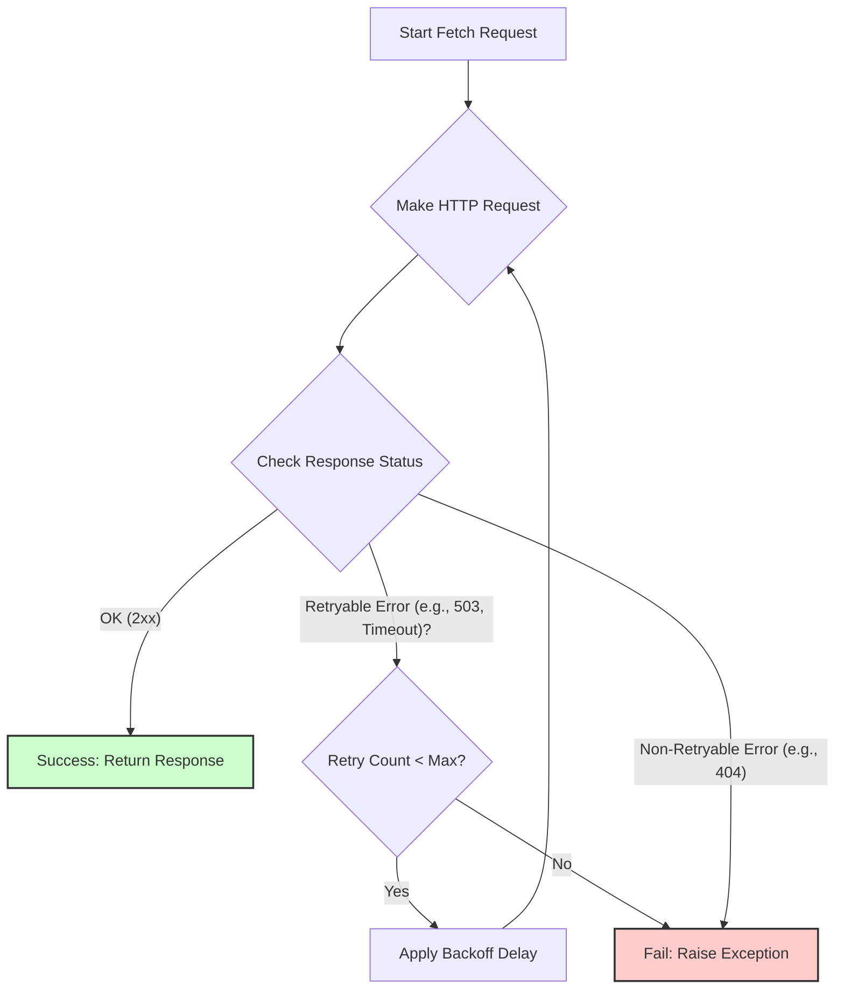

# Core Fetching Implementation (Requests)

For websites or specific endpoints that serve content as static HTML or via predictable APIs, a lightweight fetching approach is preferred for efficiency.

## Technology Choice: `requests` Library

*   **Rationale:** `requests` is the de facto standard, robust, and well-maintained Python library for making HTTP requests. It's significantly lighter in terms of resource consumption (CPU/RAM) compared to full browser automation.

## Key Implementation Features

### Retry Logic

*   **Mechanism:** Utilize the `urllib3.Retry` mechanism integrated with `requests.Session` or the `backoff` decorator library.
*   **Configuration:** Configure automatic retries for:
    *   Transient network errors (timeouts, connection issues).
    *   Specific server-side error codes (e.g., 500, 502, 503, 504).
    *   Potentially rate-limiting codes (e.g., 429) if deemed temporary.
*   **Backoff Strategy:** Employ exponential backoff with jitter between retries to avoid overwhelming servers.

### Session Management

*   Use `requests.Session` objects for:
    *   **Connection Pooling:** Reusing underlying TCP connections for better performance when making multiple requests to the same host.
    *   **Cookie Persistence:** Automatically handle cookies if needed for session management on the target site (though less common for API endpoints).

### Headers & User-Agent

*   **User-Agent Rotation:** Set appropriate `User-Agent` headers, ideally rotating them via middleware or logic within the worker to mimic different browsers and reduce blocking potential.
*   **Other Headers:** Include other standard headers (`Accept`, `Accept-Language`, etc.) to appear more like a regular browser request.

### Timeout Configuration

*   Set reasonable timeouts for connection and read operations to prevent tasks from hanging indefinitely on unresponsive servers.

## When to Use

*   Fetching `robots.txt`.
*   Accessing static HTML pages where job data is directly embedded.
*   Interacting with identified APIs (AJAX/XHR/Fetch) that return data (often JSON).
*   Simple pagination scenarios handled by URL parameters.

By defaulting to this lightweight approach and only escalating to browser automation when necessary, the system optimizes resource usage and improves overall throughput.